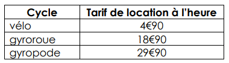
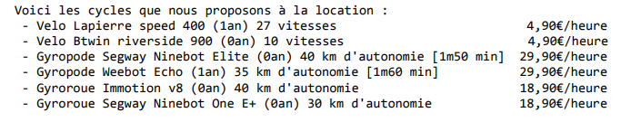

La Programmation Orientée Objet (POO) avec JAVA  
*******************************************************************
Exercice réalisé dans le cadre de ma formation Développeur Web/Web mobile avec ENI Ecole Informatique  
Janvier 2021  
****************************************************
les classes abstraites, les méthodes abstraites et les interfaces  
TP Location de cycles  
Durée estimée : 2 heure 30  
IDE : Eclipse  
**********************************************************
__Énoncé de l'exercice__  
L’objectif est de créer un programme permettant à un loueur de cycles d’afficher les
modèles proposés à la location et les tarifs pratiqués.
****************************************************************
__Indications__  
1 - Des vélos, des gyropodes et des gyroroues sont proposés à la location. Pour
chacun, il est nécessaire de connaître sa marque, son modèle ainsi que sa date
d’achat. Les vélos sont équipés d’un système de changement de vitesse. Certains
possèdent plus de vitesses que d’autres. Les gyropodes et les gyroroues ont une
certaine autonomie en kilomètres. En raison de son guidon, le gyropode nécessite
que son pilote ait une taille minimale.  

Définir les classes nécessaires pour représenter les différents cycles proposés à la
location. Indiquer les différents attributs de ces dernières et le caractère abstrait
éventuel de certaines classes.  

2 - Il est nécessaire de connaître le tarif de location de n’importe quel cycle.  
    
Ajouter aux classes précédentes les méthodes abstraites et concrètes nécessaires
pour cela. Ajouter également un constructeur et une substitution de la méthode
toString() dans chacune d’entre elles.  

3 - Création du projet :  
- Garder les options par défaut, notamment la séparation des fichiers sources et des
fichiers compilés.     

Coder les classes précédemment trouvées.  
L’ensembles des cycles proposés à la location sont stockés dans un tableau.
Voici un aperçu de l’affichage produit lorsque le tableau contenant l’ensemble des
cycles est parcouru :  

